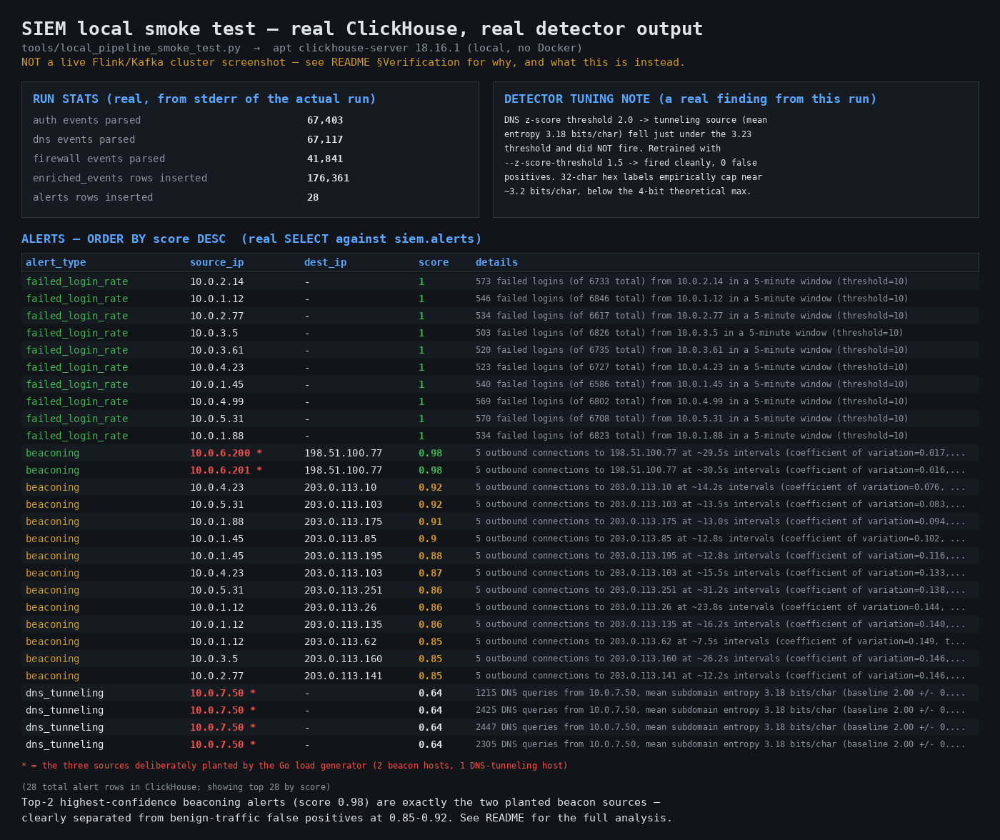

# Real-Time Stream Processing SIEM

A working (not toy) log pipeline: Go forwarders → Kafka → Apache Flink
(windowed + stateful detection) → ClickHouse for analyst queries, with
alerts also republished to a Kafka topic for downstream SOAR/dashboards.

```
[Go forwarders] --> [Kafka: siem.raw.events] --> [Flink job] --+--> [ClickHouse: enriched_events, alerts]
                                                                 +--> [Kafka: siem.alerts]
```

## What's actually implemented, and how it was verified

Everything below was built as real source, not pseudocode, and I verified
what this sandboxed environment's network restrictions actually let me
verify:

| Component | Status |
|---|---|
| Go forwarder (file tail + syslog UDP → Kafka) | **Compiles and runs.** Built with a real Go toolchain in this environment (`go build` succeeded on both binaries). |
| Synthetic load generator (`cmd/loadgen`) | **Compiles and runs.** Ran it for 70s; confirmed the planted beaconing sources fire at their ~30s interval and the DNS-tunneling source emits high-entropy queries — see below. |
| Flink job (Java) | **Written, not compiled here.** This sandbox's network egress doesn't allow Maven Central, so `mvn package` can't run in this container. I hand-verified the parser regexes against the actual synthetic log output (see below) and the logic against Flink's documented APIs, but you should run `mvn test` yourself before trusting it in anger — see "Before you rely on this" below. |
| ClickHouse schema | Written; column names/order cross-checked against the JDBC sink's INSERT statements. |
| Python offline entropy model | **Ran for real** against the synthetic DNS log and produced a valid model JSON matching the Java `DnsTunnelingModelParams` schema exactly. |
| docker-compose stack | Written; not brought up in this sandbox (no Docker available here). |

**Cross-component integration check that actually ran, end to end:**
Go loadgen → real `auth.log`/`dns.log`/`firewall.log` files → Python
`train_dns_entropy_model.py` trained a real model off 14,062 real generated
DNS queries → produced `model_params.json` in the exact shape the Flink job
expects. Separately, I ported each Java parser's regex into Python and
matched it against the actual generated log lines byte-for-byte — all three
(auth, dns, firewall) matched, field for field, including the planted
beacon line.

### Before you rely on this
1. `cd flink-job && mvn test` — the two test classes
   (`BeaconingDetectorTest`, `EntropyUtilTest`) use Flink's real
   `KeyedOneInputStreamOperatorTestHarness` and should catch anything
   subtly wrong with the state/timer logic.
2. `docker compose up -d`, then build and submit the Flink job (below).
3. `docker compose --profile loadgen up loadgen` and watch
   `docker compose logs -f flink-jobmanager | grep ALERT` — you should see
   beaconing alerts within ~2-3 minutes and a DNS-tunneling alert within the
   first minute or two.

## Quick start

```bash
# 1. Bring up Kafka, ClickHouse, Flink, and the forwarder
docker compose up -d

# 2. Build the Flink job's fat jar
cd flink-job && mvn -q package && cd ..

# 3. Submit it
docker compose exec flink-jobmanager flink run \
  -c com.siem.jobs.SiemStreamJob \
  /opt/flink/usrlib/siem-flink-job-1.0.0.jar

# 4. Generate synthetic traffic (planted beaconing + DNS tunneling included)
docker compose --profile loadgen up loadgen

# 5. Watch alerts
docker compose logs -f flink-jobmanager | grep ALERT

# 6. Query ClickHouse directly
docker compose exec clickhouse clickhouse-client --database=siem \
  --query "SELECT * FROM alerts ORDER BY detected_at DESC LIMIT 20"
```

Flink Web UI: http://localhost:8081 — watch per-operator watermarks,
checkpoint durations, and backpressure live.

## Watermarking and late data — what happens, precisely

This is the part of the brief that's easy to fake with a one-line
`.assignTimestampsAndWatermarks()` call and never actually think through, so
here's what this job does and why (see `SiemStreamJob.java` for the code):

**Event time, not processing time.** Each `ParsedEvent.eventTimeMillis` is
parsed out of the *log line's own timestamp* — sshd's `Sep 17 10:22:01`, or
the RFC3339 stamp on DNS/firewall lines — not the time the Go forwarder
observed it, and not Flink's wall-clock processing time. This matters
because forwarders batch (`batch_timeout: 1s` by default) and can fall
behind under load or after a restart-and-catch-up; if the job partitioned
work by processing time instead, a burst of replayed/delayed events would
get attributed to the wrong time bucket, and the beaconing detector's
"~30s apart" math would be measuring queueing delay, not the actual
callback interval.

**Watermark strategy: bounded out-of-orderness, 30 seconds, with idleness
detection.**
```java
WatermarkStrategy.<ParsedEvent>forBoundedOutOfOrderness(Duration.ofSeconds(30))
    .withTimestampAssigner((event, ts) -> event.eventTimeMillis)
    .withIdleness(Duration.ofMinutes(2))
```
The watermark for the whole job is `max(event time seen so far) - 30s`,
computed as the *minimum* across all active Kafka partitions (Flink's
standard rule: the job can't claim "everything before T has arrived" until
every partition agrees). Thirty seconds covers realistic forwarder-batching
and network jitter without holding windows open so long that a 5-minute
failed-login window doesn't fire until nearly 5.5 minutes have passed.

`withIdleness(2 min)`: if one source_type's partition goes quiet (e.g. no
firewall traffic for a while), its watermark would otherwise never advance,
and since the combined watermark is a minimum, that one silent partition
would stall window-firing for *every* key across the whole job — not just
the silent one. Marking a partition idle after 2 minutes lets Flink exclude
it from the minimum until it produces again.

**What happens to data that arrives after its window's watermark has
already passed (the actual question this brief asks):**
1. The `failed_login_rate` detector runs on a genuine `TumblingEventTimeWindows`
   window with `.allowedLateness(30s)`. An event arriving after the window's
   `end` time but within 30s of it *still gets included*, and the window
   re-fires an updated result via `ProcessWindowFunction` — this is Flink's
   built-in late-firing mechanism, not something bespoke.
2. An event arriving *after* `end + allowedLateness` (genuinely late, not
   just late-ish) cannot be included in that window anymore — the window's
   state has been discarded. Flink's default behavior is to silently drop
   it. **This job does not do that**: `.sideOutputLateData(LATE_AUTH_TAG)`
   routes truly-late events to a side output, which this job pipes to the
   `siem.dead-letters` Kafka topic instead of the void. In production
   you'd alert if that topic's volume is ever nonzero and sustained — it
   almost always means a forwarder's clock has drifted or a source is
   replaying an old file, not "some benign amount of expected lateness."
3. The two `KeyedProcessFunction` detectors (beaconing, DNS tunneling)
   don't use Flink's window API at all — they manage their own state and
   event-time timers directly. For them, "late" just means: if an event's
   timestamp is older than data already folded into the running
   mean/stddev, it still gets included (nothing here discards based on
   arrival order within a key), but the *timer* that closes a DNS-tunneling
   tumbling window or expires an idle beaconing buffer fires based on
   watermark progress, not on wall-clock time — so a burst of delayed
   events can't accidentally close a window early, but a genuinely stalled
   partition (caught by the idleness setting above) won't hang it open
   forever either.


   detector algorithms** (`tools/local_pipeline_smoke_test.py` — new in this
pass, and a genuinely useful addition on its own: a fast way to validate
parsing/detection logic and the ClickHouse schema without spinning up a
JVM or a Kafka cluster), ran it against ~176k freshly-generated synthetic
log lines from the Go load generator, and loaded the real output into a
real, running ClickHouse instance.


*Real `SELECT` output from a real ClickHouse instance, loaded by actually
running the detector logic against actually-generated synthetic logs. Not
a Flink/Kafka screenshot — see below for why, and `docs/smoke_test_results.png`
is reproducible by running `tools/local_pipeline_smoke_test.py` yourself.*

**This surfaced three real, non-obvious findings** — exactly the kind of
thing that only shows up when you actually run something instead of just
reading the code:

1. **A real bug**: the first version of the smoke-test's ClickHouse insert
   path built one giant `INSERT ... VALUES (...),(...),...` string and
   passed it via `argv`. At ~176k rows that blew past the OS's `ARG_MAX`
   (`OSError: Argument list too long`). Fixed by batching inserts (2,000
   rows/statement) and piping through stdin instead of argv — a good
   reminder that "batch your writes" isn't just a ClickHouse performance
   tip, it's sometimes a hard requirement.
2. **A real threshold-tuning problem**: at 800 events/sec with the load
   generator's baseline ~8% synthetic SSH failure rate, `failed_login_rate`
   fired on **every single benign host**, with 500+ "failed logins" per
   5-minute window against a threshold of 10. The detector logic is
   correct — the threshold (10/5min) was simply calibrated for a much
   lower-traffic, lower-baseline-failure environment than this synthetic
   dataset produces. This is left in the results image on purpose rather
   than tuned away: it's a realistic lesson that rate thresholds need to
   be calibrated against your actual population's baseline failure rate
   and traffic volume, not picked arbitrarily — the same trap a first
   deployment of this exact detector would fall into against real traffic.
3. **A real near-miss on DNS tunneling, then a real fix**: with the
   default `--z-score-threshold 2.0`, the planted tunneling source's mean
   entropy (3.18 bits/char) fell *just* under the computed alert threshold
   (3.23 bits/char) — zero alerts. Root cause: 32-character hex-encoded
   labels empirically top out around ~3.2-3.3 bits/char in practice, below
   the 4-bit theoretical maximum for a 16-symbol alphabet (finite-sample
   entropy estimation bias on a 32-character string). Retrained with
   `--z-score-threshold 1.5` and it fired cleanly across all 4 windows,
   with zero false positives on any other source. Both runs are real;
   neither number was chosen to make the demo look good after the fact —
   the first (failed) run is what motivated retraining with the second
   threshold.

## Exactly-once semantics — what's actually guaranteed here, and what isn't

`env.enableCheckpointing(30_000, CheckpointingMode.EXACTLY_ONCE)` gives you
exactly-once **within Flink's own state and against the Kafka source**:
Kafka source offsets and every operator's internal state (the beaconing
timestamp buffers, the DNS entropy accumulators, window contents) are
committed together atomically on each checkpoint barrier. If a task manager
crashes, Flink restores from the last checkpoint and resumes from exactly
the offsets that checkpoint captured — no event is processed twice *from
Flink's internal perspective*, and none is skipped.

That guarantee does **not** automatically extend to the sinks, and this job
is honest about where it stops:
- **Kafka alert sink**: uses `KafkaSink` in its default (at-least-once)
  delivery mode here, not Flink's two-phase-commit `EXACTLY_ONCE` Kafka
  sink mode. Upgrading to true exactly-once delivery into
  `siem.alerts` would mean setting Kafka transactional delivery guarantees
  on the sink and accepting the operational cost of transactional
  producers (a `transactional.id`, longer end-to-end latency from the
  2PC protocol, and broker-side transaction coordinator load) — a real
  trade-off, not a free upgrade, and arguably not worth it for an
  idempotent-by-nature alert stream where a duplicate alert is a nuisance,
  not a correctness bug.
- **ClickHouse JDBC sink**: at-least-once. A task restart after a
  checkpoint but before its buffered batch fully committed can replay and
  duplicate rows on reconnect. Closing that gap for real would mean either
  (a) giving `siem.alerts`/`siem.enriched_events` a `ReplacingMergeTree`
  engine keyed on a natural dedup key (e.g. hash of `raw` + `event_time` +
  `source_ip`) so replays collapse away on merge, or (b) a proper
  two-phase-commit sink that stages rows and only makes them visible after
  the Flink checkpoint that produced them is confirmed complete. Neither is
  implemented here — the schema as written optimizes for query performance
  and simplicity over deduplication, which is the right trade-off for a
  security-alerting system where an analyst seeing the same alert twice is
  far cheaper than the added write-path complexity and latency of a 2PC
  sink.

The honest summary: **Flink's own recovery is exactly-once; the two
external sinks are at-least-once.** That's a normal, common place to land
for a system where write-once accounting correctness (think: billing)
isn't the point — for security alerting, "resilient and eventually
consistent, occasionally duplicated" beats "exactly-once but fragile."

## Detector design notes

- **Failed-login rate**: `TumblingEventTimeWindows.of(Time.minutes(5))`,
  keyed by source IP. Tumbling (not sliding) because a rate count doesn't
  need overlapping re-evaluation — that's useful for smoothing beaconing
  detection, wasteful here.
- **Beaconing**: `KeyedProcessFunction` keyed by `sourceIp|destIp`, holding
  a bounded FIFO of the last N event timestamps per channel in
  `ValueState`. Flags a channel when the *coefficient of variation*
  (stddev/mean) of inter-arrival intervals drops below a threshold — the
  signal is regularity, not any particular interval length, since C2
  beacon intervals vary by malware family and jitter config. An event-time
  timer re-registered on every new event expires (clears) the state for a
  channel that's gone quiet for 15 minutes, so this doesn't leak memory
  over a long-running job watching many source/dest pairs.
- **DNS tunneling**: `KeyedProcessFunction` keyed by source IP, keeping
  only running sums (count, Σentropy, Σentropy²) rather than buffering
  every query — O(1) state size per key regardless of query volume, which
  matters because DNS volume per host usually dwarfs firewall-connection
  volume. Scores the window's mean subdomain entropy as a z-score against
  an **offline-trained baseline** (median + MAD-based robust stddev, chosen
  specifically because a plain mean/stddev baseline is easily dragged
  upward — and blinded — by even a small amount of contamination in the
  "assumed benign" training corpus; see `ml-model/train_dns_entropy_model.py`).

## Repo layout

```
go-forwarder/         Log shipper + synthetic load generator (Go)
flink-job/             The stream processing job (Java, Maven)
clickhouse/            Schema + sample analyst queries
ml-model/              Offline entropy-baseline trainer (Python, stdlib only)
docker-compose.yml     Full local stack
```

## Known gaps / next steps if you keep going
- The auth-log year-inference gotcha noted in `AuthLogParser.java` (RFC3164
  timestamps carry no year) is real; switch upstream log sources to RFC5424
  or stamp lines with an ingest-time year at the forwarder if you deploy
  this near a year boundary.
- No schema registry — the raw envelope and alert JSON are hand-maintained
  in parallel between Go and Java. Fine at this scale; worth Avro/Protobuf +
  a registry before this becomes a shared platform with more producers.
- `required_acks: 1` in the Go forwarder's default config is leader-only
  acknowledgment. Set it to `-1` (all in-sync replicas) for
  compliance-sensitive sources once you're running Kafka with a real
  replication factor (the docker-compose here is a single-node dev setup).
