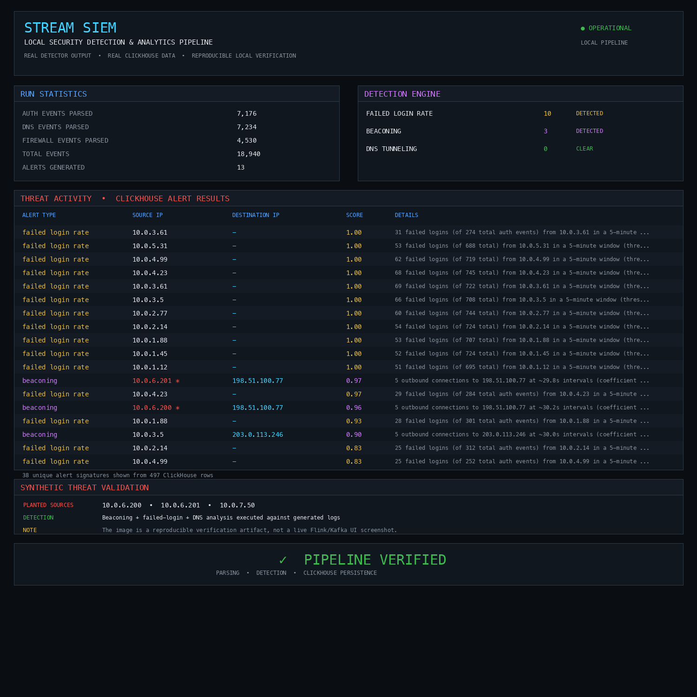

# Stream SIEM

A real-time security telemetry pipeline built around **Go, Apache Kafka, Apache Flink, ClickHouse, Java, and Python**.

The project ingests authentication, DNS, and firewall telemetry; normalizes it into a common event model; applies stateful event-time detection; persists enriched events and alerts in ClickHouse; and republishes alerts to Kafka.



> The image above is a reproducible local verification artifact generated from real detector output and ClickHouse data. It is not a mock dashboard.

---

## What this project demonstrates

This repository is intentionally built as an end-to-end security engineering project rather than a collection of isolated components.

```
Synthetic telemetry
       |
       v
   Go Loadgen
       |
       v
  Go Forwarder
       |
       v
Apache Kafka
siem.raw.events
       |
       v
 Apache Flink
       |
       +-------------------+
       |                   |
       v                   v
  ClickHouse          Kafka alerts
 enriched_events      siem.alerts
 alerts               dead letters
       |
       v
 Detection / analytics / Web UI
```

The local validation path has been exercised across:

- Docker Compose infrastructure
- Go forwarder and synthetic load generator
- Kafka topics and offsets
- Java/Flink unit tests
- Maven packaging
- Flink event-time processing
- checkpoint completion
- ClickHouse persistence
- Python parser/detector smoke testing
- ClickHouse schema validation
- README verification rendering
- GitHub Actions CI for Java, Go, Python, and Compose configuration

---

# Detection capabilities

## Failed-login rate

Detects repeated authentication failures from a source IP using a **5-minute tumbling event-time window**.

- Key: source IP
- Default threshold: 10 failed logins
- Event-time processing
- Configurable threshold
- Alert score based on observed failure count

## Beaconing

Detects repeated outbound connections whose inter-arrival times are unusually regular.

The detector:

- keys state by `sourceIp|destIp`
- keeps a bounded timestamp buffer
- calculates inter-arrival intervals
- calculates coefficient of variation (CV)
- requires a minimum number of observations
- constrains the average interval
- expires inactive state
- applies an alert cooldown

Default development settings include:

```
max samples:       20
minimum samples:    5
maximum CV:       0.15
minimum interval:  5 seconds
maximum interval:  1 hour
idle expiry:       15 minutes
```

The signal is periodic behavior rather than a hard-coded malicious destination.

## DNS tunneling

Detects DNS activity whose subdomain entropy is statistically unusual relative to an offline-trained baseline.

The detector:

- keys state by source IP
- calculates Shannon entropy
- maintains running statistics
- evaluates a configurable tumbling window
- calculates a z-score against the trained baseline
- emits an alert when the configured threshold is exceeded

The Python baseline trainer uses a median/MAD-based robust scale estimate.

---

# Event-time processing

The Flink pipeline is deliberately event-time based.

- **30-second bounded out-of-orderness**
- **2-minute source idleness detection**
- **30-second allowed lateness for failed-login windows**
- authentication late-data dead-letter handling
- stateful detector operators
- RocksDB state backend
- incremental checkpoints

Authentication records use RFC3164-style timestamps, which do not contain a year. The current parser infers the current UTC year. Long-term replay across a year boundary should use timestamps containing an explicit year or normalize them upstream.

---

# Delivery and recovery semantics

Flink checkpointing is configured for exactly-once state consistency:

```java
env.enableCheckpointing(30_000, CheckpointingMode.EXACTLY_ONCE);
```

The current external sink semantics are:

| Component | Current behavior |
|---|---|
| Flink managed state | Exactly-once checkpoint semantics |
| Kafka alert sink | At-least-once |
| ClickHouse JDBC sink | At-least-once |

A task restart can replay a sink batch. The current ClickHouse MergeTree schema does not provide sink-level deduplication.

---

# Local environment

The development stack uses:

| Component | Version / runtime |
|---|---|
| Java | 17 |
| Maven | 3.x |
| Go | 1.25.x |
| Python | 3.x |
| Kafka | 3.7.1 |
| Flink | 1.19.1 Java 17 |
| ClickHouse | 24.8 |
| Docker Compose | v2.x |

The repository contains a Docker Compose stack with:

- Kafka
- Kafka topic initializer
- ClickHouse
- Flink JobManager
- 2 Flink TaskManagers
- Go forwarder
- optional Go load generator

---

# Quick start

## 1. Clone and enter the repository

```bash
git clone https://github.com/locallhosts/stream-siem.git
cd stream-siem
```

## 2. Configure local ClickHouse credentials

Create a local `.env` file:

```dotenv
CLICKHOUSE_USER=siem
CLICKHOUSE_PASSWORD=change_this_for_your_environment
```

The file is ignored by Git. Do not commit real credentials.

## 3. Start Docker infrastructure

```bash
docker compose config
docker compose up -d
docker compose ps
```

Expected services include:

```
kafka
clickhouse
flink-jobmanager
flink-taskmanager
forwarder
```

The load generator is intentionally disabled by default.

Check service health:

```bash
docker compose ps
docker compose logs --tail=100 kafka
docker compose logs --tail=100 clickhouse
docker compose logs --tail=100 flink-jobmanager
docker compose logs --tail=100 forwarder
```

---

# Kafka verification

List topics:

```bash
docker exec siem-kafka /opt/kafka/bin/kafka-topics.sh \
  --bootstrap-server kafka:29092 \
  --list
```

The development stack creates:

```
siem.raw.events
siem.alerts
siem.dead-letters
```

Check raw-event offsets:

```bash
docker exec siem-kafka /opt/kafka/bin/kafka-get-offsets.sh \
  --bootstrap-server kafka:29092 \
  --topic siem.raw.events
```

Consume alert messages:

```bash
docker exec -it siem-kafka /opt/kafka/bin/kafka-console-consumer.sh \
  --bootstrap-server kafka:29092 \
  --topic siem.alerts \
  --from-beginning
```

Inside Docker, Flink and the Go forwarder use:

```
kafka:29092
```

Host-side Kafka tools use:

```
localhost:9092
```

This distinction is important because Kafka advertises different listeners for containers and the host.

---

# ClickHouse verification

Verify authentication:

```bash
docker compose exec clickhouse sh -lc \
  'clickhouse-client \
    --user "$CLICKHOUSE_USER" \
    --password "$CLICKHOUSE_PASSWORD" \
    --query "SELECT currentUser()"'
```

Expected:

```
siem
```

List databases:

```bash
docker compose exec clickhouse sh -lc \
  'clickhouse-client \
    --user "$CLICKHOUSE_USER" \
    --password "$CLICKHOUSE_PASSWORD" \
    --query "SHOW DATABASES"'
```

List SIEM tables:

```bash
docker compose exec clickhouse sh -lc \
  'clickhouse-client \
    --user "$CLICKHOUSE_USER" \
    --password "$CLICKHOUSE_PASSWORD" \
    --database siem \
    --query "SHOW TABLES"'
```

Query enriched events:

```bash
docker compose exec clickhouse sh -lc \
  'clickhouse-client \
    --user "$CLICKHOUSE_USER" \
    --password "$CLICKHOUSE_PASSWORD" \
    --database siem \
    --query "SELECT event_time, source_type, source_ip, dest_ip, dest_port FROM enriched_events ORDER BY event_time DESC LIMIT 20"'
```

Query alerts:

```bash
docker compose exec clickhouse sh -lc \
  'clickhouse-client \
    --user "$CLICKHOUSE_USER" \
    --password "$CLICKHOUSE_PASSWORD" \
    --database siem \
    --query "SELECT detected_at, alert_type, source_ip, dest_ip, score, details FROM alerts ORDER BY detected_at DESC LIMIT 20"'
```

Useful counts:

```bash
docker compose exec clickhouse sh -lc \
  'clickhouse-client \
    --user "$CLICKHOUSE_USER" \
    --password "$CLICKHOUSE_PASSWORD" \
    --database siem \
    --query "SELECT count() FROM enriched_events"'

docker compose exec clickhouse sh -lc \
  'clickhouse-client \
    --user "$CLICKHOUSE_USER" \
    --password "$CLICKHOUSE_PASSWORD" \
    --database siem \
    --query "SELECT count() FROM alerts"'
```

---

# Build and test the Java/Flink job

The project uses Maven, not Gradle.

From the repository root:

```bash
mvn -f flink-job/pom.xml clean verify
```

This performs compilation, tests, packaging, and verification.

Build only:

```bash
mvn -f flink-job/pom.xml clean package
```

The shaded Flink artifact is:

```
flink-job/target/siem-flink-job-1.0.0.jar
```

Run the Flink unit tests:

```bash
mvn -f flink-job/pom.xml test
```

The test suite includes stateful detection tests such as:

- regular 30-second beaconing traffic
- irregular traffic that should remain silent
- event-time/watermark driven operator behavior

---

# Submit the Flink job

After building the JAR:

```bash
docker compose exec flink-jobmanager flink run \
  -c com.siem.jobs.SiemStreamJob \
  /opt/flink/usrlib/siem-flink-job-1.0.0.jar
```

List jobs:

```bash
curl -s http://localhost:8081/jobs/overview | python3 -m json.tool
```

Open the Flink Web UI:

```
http://localhost:8081
```

The Web UI is useful for recording:

- running job state
- source partitions
- operator state
- checkpoints
- task managers
- parallelism
- backpressure
- operator throughput

Check recent JobManager logs:

```bash
docker compose logs --tail=200 flink-jobmanager
```

Look specifically for successful source discovery, running operators, and completed checkpoints.

---

# Go forwarder tests

The Go module lives under `go-forwarder/`.

Run all Go tests:

```bash
cd go-forwarder
go test ./...
```

Build the forwarder:

```bash
go build ./cmd/forwarder
```

Build the synthetic load generator:

```bash
go build ./cmd/loadgen
```

Return to the repository root:

```bash
cd ..
```

The Docker forwarder uses:

```
go-forwarder/config.docker.yaml
```

It tails:

```
/var/log/siem/auth.log
/var/log/siem/dns.log
/var/log/siem/firewall.log
```

and sends normalized raw envelopes to:

```
siem.raw.events
```

Check forwarder logs:

```bash
docker compose logs -f forwarder
```

Check metrics:

```bash
curl http://localhost:9109/metrics
```

---

# Generate deterministic synthetic telemetry

The Go load generator plants known patterns for defensive validation.

Planted sources:

```
10.0.6.200  -> 198.51.100.77:443
10.0.6.201  -> 198.51.100.77:443
10.0.7.50   -> high-entropy DNS labels
```

The destination ranges are reserved documentation ranges:

```
198.51.100.0/24
203.0.113.0/24
```

They are test addresses, not indicators of real infrastructure.

For a short Docker run:

```bash
docker compose --profile loadgen run --rm loadgen \
  -rate 100 \
  -duration 30s \
  -out-dir /var/log/siem
```

For the configured default Compose load:

```bash
docker compose --profile loadgen up loadgen
```

The default service configuration generates approximately:

```
2,000 events/sec
30 minutes
```

For direct local Go execution:

```bash
cd go-forwarder
go run ./cmd/loadgen \
  -rate 100 \
  -duration 2m \
  -out-dir ./synthetic-logs
cd ..
```

---

# Python smoke test

The repository includes:

```
tools/local_pipeline_smoke_test.py
```

It mirrors the Java parser and detector logic in a fast single-process validation path.

It validates:

- authentication parsing
- DNS parsing
- firewall parsing
- failed-login detection
- beaconing detection
- DNS entropy calculations
- alert generation
- ClickHouse schema compatibility
- ClickHouse insertion

Run syntax validation:

```bash
python3 -m py_compile tools/local_pipeline_smoke_test.py
python3 -m py_compile tools/render_smoke_test_results.py
```

Run the smoke test against generated logs:

```bash
python3 tools/local_pipeline_smoke_test.py \
  --auth-log ./synthetic-logs/auth.log \
  --dns-log ./synthetic-logs/dns.log \
  --firewall-log ./synthetic-logs/firewall.log \
  --model-params ./ml-model/model_params.json \
  --clickhouse-insert
```

The smoke test is intentionally not a replacement for Flink. It uses a single sorted-by-timestamp process and therefore does not prove distributed behavior under Kafka partitioning, out-of-order delivery, concurrent task execution, checkpoints, or recovery.

---

# Python DNS model training

Train the DNS baseline:

```bash
python3 ml-model/train_dns_entropy_model.py \
  --input ./synthetic-logs/dns.log \
  --output ./ml-model/model_params.json
```

Optional controls include:

```
--z-score-threshold
--min-queries-per-window
--window-size-ms
```

The generated model parameters are consumed by the Java DNS detector.

---

# Verified local end-to-end test

One of the completed local validation runs processed:

| Metric | Result |
|---|---:|
| Authentication events parsed | 7,176 |
| DNS events parsed | 7,234 |
| Firewall events parsed | 4,530 |
| Total events | **18,940** |
| Enriched ClickHouse rows inserted | **18,940** |
| Alerts generated | **13** |
| Failed-login alerts | **10** |
| Beaconing alerts | **3** |
| DNS-tunneling alerts | **0** |

The beaconing validation included the planted sources:

```
10.0.6.200 -> 198.51.100.77
10.0.6.201 -> 198.51.100.77
```

The Python smoke test reported beaconing detections with approximately 30-second intervals and CV values below the configured 0.15 threshold.

The DNS detector result of zero in this particular baseline run is intentional test information: the baseline was trained from the same synthetic distribution. The DNS detector should be tested separately with deliberately anomalous DNS input rather than changing the detector merely to force an alert.

---

# Full distributed pipeline test

For a true end-to-end test, run the components in this order:

### 1. Start infrastructure

```bash
docker compose up -d
```

### 2. Build Java

```bash
mvn -f flink-job/pom.xml clean verify
```

### 3. Submit Flink

```bash
docker compose exec flink-jobmanager flink run \
  -c com.siem.jobs.SiemStreamJob \
  /opt/flink/usrlib/siem-flink-job-1.0.0.jar
```

### 4. Start synthetic telemetry

```bash
docker compose --profile loadgen run --rm loadgen \
  -rate 100 \
  -duration 70s \
  -out-dir /var/log/siem
```

### 5. Watch Kafka

```bash
docker exec siem-kafka /opt/kafka/bin/kafka-get-offsets.sh \
  --bootstrap-server kafka:29092 \
  --topic siem.raw.events
```

### 6. Watch Flink

```bash
docker compose logs -f flink-jobmanager
```

### 7. Query ClickHouse

```bash
docker compose exec clickhouse sh -lc \
  'clickhouse-client \
    --user "$CLICKHOUSE_USER" \
    --password "$CLICKHOUSE_PASSWORD" \
    --database siem \
    --query "SELECT alert_type, source_ip, dest_ip, score FROM alerts ORDER BY detected_at DESC LIMIT 30"'
```

This gives a complete:

```
Go generator
    ↓
shared log volume
    ↓
Go forwarder
    ↓
Kafka
    ↓
Flink
    ↓
detectors
    ↓
ClickHouse + Kafka alerts
    ↓
Web UI / analyst view
```

---

# Rendering the verification image

The repository contains:

```
tools/render_smoke_test_results.py
```

It creates:

```
docs/images/smoke-test-results.png
docs/images/smoke-test-results-full.png
```

Run:

```bash
python3 tools/render_smoke_test_results.py
```

Open it on macOS:

```bash
open docs/images/smoke-test-results.png
```

The image is intended as a reproducible README artifact showing:

- event counts
- detector counts
- source IPs
- destination IPs
- alert scores
- ClickHouse alert output
- planted validation sources

It should not be described as a live Flink/Kafka screenshot.

---

# Web UI / screen-recording checklist

The Web UI should expose the same evidence that was validated from the command line.

For a clean project demonstration, record these stages:

### Infrastructure

```bash
docker compose ps
```

Show Kafka, ClickHouse, JobManager, TaskManagers, and forwarder.

### Java/Flink

```bash
mvn -f flink-job/pom.xml clean verify
```

Then show the Flink Web UI:

```
http://localhost:8081
```

### Go

```bash
cd go-forwarder
go test ./...
go build ./cmd/forwarder
go build ./cmd/loadgen
cd ..
```

### Python

```bash
python3 -m compileall -q ml-model tools
```

Then run the local smoke test.

### Kafka

Show:

```
siem.raw.events
siem.alerts
siem.dead-letters
```

and the changing raw-event offsets.

### ClickHouse

Show:

```
enriched_events
alerts
alert_hourly_rollup
```

and query source IP → destination IP → score.

### Detection

Show the planted:

```
10.0.6.200
10.0.6.201
10.0.7.50
```

and the resulting detector output.

### Final dashboard

The final Web UI should make the complete path visible:

```
INGEST
  ↓
PARSE
  ↓
DETECT
  ↓
ALERT
  ↓
STORE
  ↓
VISUALIZE
```

This makes the screen recording demonstrate the actual system rather than a static UI.

---

# CI

GitHub Actions validates four areas:

### Java / Maven

```bash
mvn -B -ntp clean verify -f flink-job/pom.xml
```

### Go

```bash
go test ./...
go build ./cmd/forwarder
go build ./cmd/loadgen
```

### Python

```bash
python -m compileall -q ml-model tools
```

### Docker Compose

```bash
docker compose config -q
```

The workflow is under:

```
.github/workflows/gradle.yml
```

The filename is historical; the workflow itself now uses Maven rather than Gradle.

---

# Project structure

```
.
├── .github/
│   └── workflows/
│       └── gradle.yml
│
├── clickhouse/
│   ├── schema.sql
│   ├── schema.local-smoke-test.sql
│   └── sample_queries.sql
│
├── flink-job/
│   ├── pom.xml
│   └── src/
│       ├── main/java/com/siem/
│       │   ├── functions/
│       │   ├── jobs/
│       │   ├── model/
│       │   ├── parse/
│       │   └── sink/
│       └── test/
│
├── go-forwarder/
│   ├── cmd/
│   │   ├── forwarder/
│   │   └── loadgen/
│   ├── internal/
│   │   ├── config/
│   │   ├── metrics/
│   │   ├── sink/
│   │   └── source/
│   └── config.docker.yaml
│
├── ml-model/
│   ├── train_dns_entropy_model.py
│   └── requirements.txt
│
├── tools/
│   ├── local_pipeline_smoke_test.py
│   └── render_smoke_test_results.py
│
├── docs/
│   └── images/
│       ├── smoke-test-results.png
│       └── smoke-test-results-full.png
│
└── docker-compose.yml
```

---

# ClickHouse data model

The `siem` database contains:

- `enriched_events`
- `alerts`
- `alert_hourly_rollup`
- `alert_hourly_rollup_mv`

The enriched event model includes:

```
event_time
source_type
source_ip
dest_ip
dest_port
user
auth_success
dns_query
host
raw
ingested_at
```

Alert records include:

```
detected_at
window_start
window_end
alert_type
source_type
source_ip
dest_ip
score
details
```

---

# Operational considerations

This repository is a development and research implementation rather than a turnkey production deployment.

Before production use, review:

- Kafka replication and acknowledgements
- Kafka TLS/authentication
- ClickHouse authentication and network exposure
- durable Flink checkpoint storage
- sink idempotency/deduplication
- schema/version management
- timestamp normalization
- DNS training data quality
- detector thresholds and false-positive rates
- dead-letter monitoring
- secrets management
- retention and compliance requirements

The Docker Compose configuration intentionally uses a single Kafka broker and development-oriented settings.

---

# Security scope

The synthetic traffic is designed for defensive testing of the detection pipeline.

The project demonstrates behavioral detection rather than reputation-based blocking. The detectors look for:

- repeated authentication failures
- periodic outbound connections
- anomalous DNS label entropy

The reserved documentation IP addresses used by the generator are test infrastructure and should not be interpreted as real command-and-control infrastructure.

---

# License

See [LICENSE](LICENSE).
